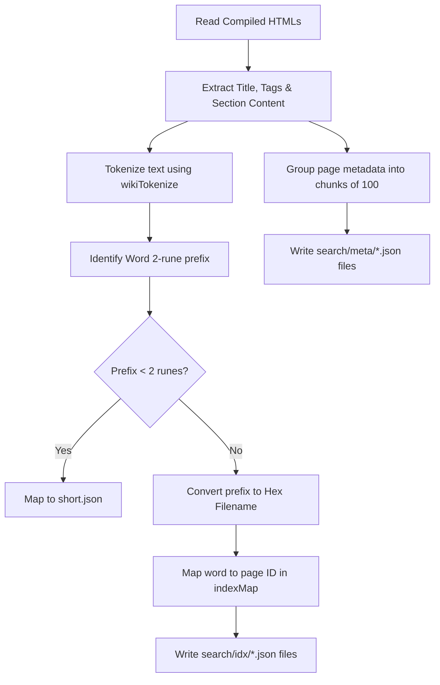

# 🔴 04. Prefix-Sharded Static Search Engine (प्रीफ़िक्स-शार्डेड स्टेटिक सर्च इंजन)

CuriousWiki का सबसे optimized और robust feature इसका **Prefix-Sharded Static Search Engine** है। यह 20,000+ pages तक स्केल होने वाली static websites (जैसे GitHub Pages) के लिए design किया गया है, जो extremely lightweight है और 3G/slow-network mobile devices पर भी instant search perform करता है।

---

## ❓ Why the Change? (यह बदलाव क्यों किया गया?)

आमतौर पर static websites dynamic searches के लिए heavy third-party APIs (जैसे Algolia) या pure client-side JSON files (जैसे MiniSearch, Lunr.js) का use करती हैं।
* **JSON Index Issue**: जब articles की संख्या हज़ारों में जाती है, तो search index database file का size MBs में चला जाता है। 3G mobile devices पर MBs की JSON file load करना initial page loading को block कर देता है और memory usage बढ़ा देता है।
* **SQLite WASM/SQL.js Issue**: SQLite WebAssembly (WASM) implementation high performance search provide करता है, लेकिन इसके लिए browser को ~1-2 MB का SQL.js engine core logic bundle download करना पड़ता है, और GitHub Pages जैसे static host पर complete `wiki.db` (जो हज़ारों pages के साथ 10-50 MB हो जाएगी) client-side browser memory में pull करनी पड़ती है। यह dynamic server के बिना static web hosting के लिए impractical है।

**हमारा समाधान**: **Prefix-Sharded Static Search Index**। 

---

## 🏗️ 1. Prefix-Sharded Search Architecture (आर्किटेक्चर विवरण)

यह system runtime indexing load को build-time compilation layer पर shift कर देता है। Build-time (in Nim) में complete site indexing logic execute करके search-database को हज़ारों छोटे-छोटे tiny shards (JSON files) में split कर दिया जाता है।

### A. Folder Structure (फ़ोल्डर संरचना)
Compilation के बाद `./search/` directory में निम्नलिखित structures generate होती हैं:
```text
search/
├── config.json              # Search config parameters (total_pages, chunk_size)
├── idx/                     # 2-letter Hex Word Shards (जैसे 7072.json for "pr")
└── meta/                    # 100-page details chunks (जैसे 0.json, 1.json)
```

### B. 2-Letter Hex Prefix Index Sharding
सारे unique words (जो search index में save होते हैं) को उनके **first 2 characters** के prefix के base पर distinct files में shard किया जाता है।
* filenames को dynamic character encoding bugs से बचाने के लिए **Hexadecimal bytes string representation** में encode किया जाता है।
* उदाहरण के लिए:
  - `"preseed"` / `"production"` words start with `"pr"` -> UTF-8 bytes hex: `7072`. File: `search/idx/7072.json`.
  - `"समस्या"` word starts with `"सम"` -> UTF-8 bytes hex: `e0a4b8e0a4ae`. File: `search/idx/e0a4b8e0a4ae.json`.
* इस architecture की वजह से client browser को कभी भी complete index load नहीं करना पड़ता। User जिस character range को type करता है, सिर्फ उसी prefix shard file को fetch किया जाता है।

### C. Chunked Metadata
Pages की full meta details (title, path, tags, snippet) को large single file में रखने के बजाय **100 pages per chunk** (ChunkSize = 100) की small files में store किया जाता है:
* `search/meta/0.json` maps page IDs `0` to `99`.
* `search/meta/1.json` maps page IDs `100` to `199`.
* Search match criteria resolve होने के बाद, client-side dynamic fetches **sirf matching pages ke chunk files** को parallel fetch करते हैं।

---

## 🛠️ 2. Build-Time Generation Method (बिल्ड-टाइम कंपाइलेशन)

[build.nim](file:///home/narayanas/Documents/CuriousWiki/build.nim) file compilation layer handle करती है। 

### A. Custom Tokenizer (`wikiTokenize` proc)
Nim code में Unicode custom tokenizer implement किया गया है, जो both English alphanumeric words और Hindi Unicode code ranges (`\u0900` to `\u097F`) को parse करता है:
* Common Stop Words (जैसे `the`, `of`, `में`, `और`) को filter-out किया जाता है, जिससे index size minimal रहता है।
* 2-character से छोटे words को `search/idx/short.json` shard में index किया जाता है।

### B. Sharding Logic Flow


---

## 🔍 3. Client-Side Query Execution (क्लाइंट-साइड सर्च निष्पादन)

[main.js](file:///home/narayanas/Documents/CuriousWiki/js/main.js) file background web-workers के overhead के बिना directly main UI thread पर search resolve करती है:

### A. Query Resolution steps:
1. **Query Tokenization**: User query को lowercase tokens में split किया जाता है (e.g. `"preseed mirror"` -> `["preseed", "mirror"]`).
2. **Shard Fetches**:
   - Each token के first 2 characters को JavaScript `TextEncoder()` के ज़रिये matching UTF-8 Hex byte string में convert किया जाता है.
   - Browser client corresponding shard dynamic request send करता है:
     ```javascript
     const prefixHex = stringToHex(token.substring(0, 2));
     const shard = await fetchJson(`search/idx/${prefixHex}.json`);
     ```
3. **Keyword Prefix Matching**: Shard load होने के बाद, client exact matches और partial prefix matches (e.g., query `"pres"` matches key `"preseed"`) find करता है।
4. **Multi-Token Scoring & Ranking**:
   - Pages match count calculate की जाती है (prioritizing pages matching more search terms - AND logic).
   - Exact matching keywords को higher weightage (10 points) और partial matches को lower weightage (3 points) assigned किया जाता है.
   - IDs sort करके top 50 matches calculate किए जाते हैं.
5. **Metadata Batch Load**:
   - Matching page IDs के base पर target chunks list mapping identify की जाती है (e.g. page ID `125` mappings belongs to chunk `1`).
   - `Promise.all` use करके strictly needed chunks parallel loads किए जाते हैं:
     ```javascript
     await Promise.all(neededChunks.map(chunkIdx => getMetaChunk(chunkIdx)));
     ```
   - Matches resolve and render complete UI representation elements display triggers.

---

## ⚡ 4. Rationale & Performance Metrics (प्रदर्शन संकेतक)

| Metric / Feature | SQLite WASM / SQLite FTS5 | Prefix-Sharded Static Search |
| :--- | :--- | :--- |
| **Initial Load Overhead** | ~1.5 MB (sql-wasm.js + WASM binary) | **0 bytes** (No code loaded until query starts) |
| **Bandwidth (for 20k pages)** | Complete database file (~10-40 MB) | **<25 KB** (Only fetch matching query prefix & meta chunk) |
| **Server Requirement** | Static Host/Local files (ArrayBuffer fetch) | Static Host/Local files (Static JSON fetches) |
| **3G Device Friendliness** | Heavy (can freeze page / memory pressure) | **Ultra-lightweight** (fetch tiny files on demand) |
| **Zero-Node Compatibility** | Yes (compiled by Nim) | **Yes** (compiled by Nim, 100% static JSONs) |

---

## 🔗 Related Documentation (संबंधित दस्तावेज़)
* **[README Index (मुख्य निर्देशिका)](file:///home/narayanas/Documents/CuriousWiki/docs/README.md)**
* **[02. Compilation & Build Systems](file:///home/narayanas/Documents/CuriousWiki/docs/02-compilation-build.md)**
* **[03. Dynamic Path Resolution](file:///home/narayanas/Documents/CuriousWiki/docs/03-path-resolution.md)**
